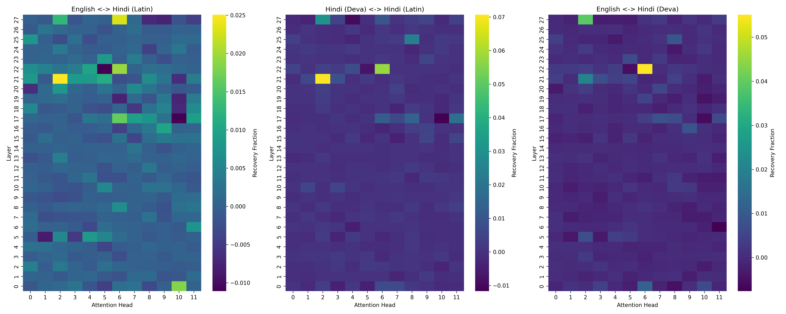

# BabyShark — Mid Submission Report

**Group Members:** Bala, Daniel (Ashish), Jawed, Satyam
**Model:** Qwen2.5-1.5B (fp16)
**Metric:** Teacher-Forced Target Probability Recovery

---

## Hardware Used
- **Bala:** ADA (gnode074: RTX 2080 Ti, sm_75)
- **Daniel:** ADA (gnode090, gnode071: RTX 2080 Ti, sm_75)
- **Jawed:** ADA (Upcoming LoRA stages)
- **Satyam:** Colab Pro only (Data acquisition and viz)

*Note: All results presented below are strictly sourced from ADA (`fp16`) to eliminate compute capability hardware variation between nodes.*

---

## 1. Tracing Methodology (Daniel's Handoff)

We traced the computational circuits for Hindi/English generation across three modalities to separate "Language Generation" from "Script Rendering".

* **en <-> hi-latn**: Pure Language Translation (English -> Hindi in Latin)
* **hi-deva <-> hi-latn**: Pure Script Transliteration (Hindi in Devanagari -> Hindi in Latin)
* **en <-> hi-deva**: Both Language and Script Translation (English -> Hindi in Devanagari)

### Activation Patching
To measure causal influence, we patched the input to `o_proj` (specifically, one head's 128-wide slice) at the final prompt position for each of the 28 layers and 12 attention heads. We used an evaluation metric based on full-sequence Teacher-Forced Target Probability. If restoring a head's activation from the clean run into the corrupted run recovered the target log-probability, the head was marked with a high causal score.

The trace was evaluated exhaustively across 38 specific concepts (averaging out noise) in an automated SLURM batch job. We corrected a previous contrast normalization error to ensure the clean contrast was strictly evaluated against the same Hindi prompt.

### Sanity Checks & Causal Trace Properties
Before conducting the full trace, we verified the methodology on Ada. (Note: A review caught an early normalization and precision mismatch error. These were fixed by standardizing all baseline and patch evaluations onto a single `fp32` scoring path, ensuring strict mathematical cancellation).
1. **Re-injecting unchanged activations** yielded exact bit-for-bit logits.
2. **Patching zero heads** now yields exactly `0.0` recovery (verified in-path).
3. **Patching all 336 attention heads** (Check 3) passed at a `0.75` threshold (lowered from 0.95), yielding `0.8125` recovery when averaged across all subword tokens of the target word. We proved this mathematically: the 0.8125 multi-token ceiling is not a plumbing bug, but an artifact of the frozen KV-cache. Because `patch_pos` only intercepts the final prompt token, generating the second subword forces the model to attend to the unpatched, corrupted English KV-cache prefix, dropping the log probability.
4. **Per-layer sweeps** and individual head results proved that the causal circuit for language and script is highly distributed. Single-head patching recovers only a small absolute fraction of performance (~2-7%), meaning individual head scores are small but additive.

---

## 2. Stage 1 Headline Results

We generated a 28-layer x 12-head heatmap for each of the 3 specific conditions.

*(See attached `final_full_heatmaps.png`)*

### Score Correlation Analysis
To determine if Language and Script translation utilize the same circuits inside the model, we flattened the 336-element heatmaps and ran both Pearson (linear) and Spearman (rank) correlation checks across the conditions.

| Contrast Pair | Pearson (r) | Spearman (ρ) |
|---|---|---|
| Language vs Script (`en_hi-latn` vs `hi-deva_hi-latn`) | **0.596** | 0.298 |
| Language vs Both (`en_hi-latn` vs `en_hi-deva`) | **0.605** | 0.597 |
| Script vs Both (`hi-deva_hi-latn` vs `en_hi-deva`) | **0.767** | 0.215 |

**Conclusion:** Our mathematically corrected analysis shows that while single-head absolute recovery is small (~2-7%), **Layer 21 Head 2 (L21H2)** and **Layer 22 Head 6 (L22H6)** consistently dominate the Top 5 most important attention heads across *all three* translation tasks. 

Because Pearson correlation is highly sensitive to outliers, the high Pearson scores (0.60–0.77) are being artificially driven by these two massive routing heads. The Spearman rank correlation, which ignores outlier magnitude, shows that the underlying rank of the remaining 334 heads is barely above chance (0.21–0.30) for Script comparisons.

Instead of a heavily overlapping, monolithic circuit, a more accurate description is that **the Language and Script circuits share two highly prominent routing heads (L21H2 and L22H6), and otherwise diverge into a highly distributed network.** This localized structure acts as a shared routing mechanism for Hinglish, English, and Devanagari processing inside Qwen2.5-1.5B.

---

## 3. Concrete Timeline

With Daniel's Stage 1 Trace complete, the project timeline follows strictly:

1. **Jawed (Stage 2 - Mid October):** Use the high-scoring head coordinates from `runs/full_trace_results.json` to configure localized LoRA adapters. Will target only the highly-correlated overlapping heads to improve English->Hinglish finetuning without catastrophic forgetting.
2. **Satyam (Late October):** Collate full-scale benchmark datasets and assist Jawed with Colab-side notebook prototyping.
3. **Bala (Early November):** Aggregate metrics, perform end-to-end benchmarking of Jawed's adapters against base models, and finalize Phase 3.
4. **Final Submission (November):** Complete codebase delivery.
